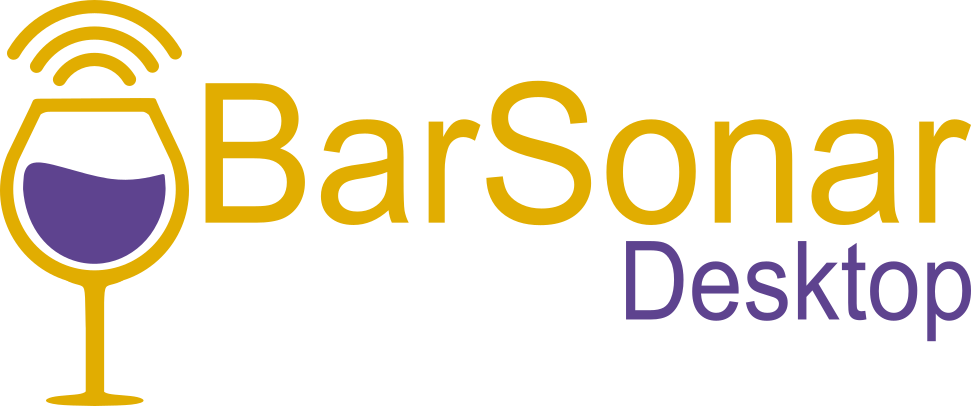

## <span style="color:purple">Tartalomjegyzék</span>
- [Tartalomjegyzék](#tartalomjegyzék)
- [Stack](#stack)
- [Az applikáció célja](#az-applikáció-célja)
- [Előfeltételek](#előfeltételek)
- [Telepítés](#telepítés)
    - [1. Klónozás és függőségek telepítése](#1-klónozás-és-függőségek-telepítése)
    - [2. Projekt megnyitása](#2-projekt-megnyitása)
- [Futtatás](#futtatás)
- [Hozzájárulás](#hozzájárulás)

---

## <span style="color:purple">Stack</span>


---

## <span style="color:purple">Az applikáció célja</span>

Ez a C# WPF asztali alkalmazás a BarSonar webes alkalmazás admin felületét valósítja meg.

Az alkalmazás a BarSonar backend végpontjatit használja, tehát ahhoz hogy az applikációt futtasd először szükséged lesz a [backendre](https://github.com/jaaajaaaja/VizsgaRemek_Backend).

A backendről részletes leírást a GitHub repository-ban találsz.

---

## <span style="color:purple">Előfeltételek</span>

A projekt futtatásához szükséges:

- **<span style="color:red">.NET SDK 10.0.102 vagy újabb</span>** (https://dotnet.microsoft.com/download)
- **<span style="color:red">Visual Studio 2022</span>** vagy **Visual Studio Code**
- **<span style="color:red">Windows 10 vagy újabb</span>**

---

## <span style="color:purple">Telepítés</span>

#### 1. Klónozás

```bash
# Klónozd a repository-t  
git clone <repository-url>
```

#### 2. Projekt megnyitása

**Visual Studio 2022-vel:**
```bash
# Nyisd meg a .slnx fájlt
barsonar-desktop.slnx
```

---

## <span style="color:purple">Futtatás</span>

**Visual Studio 2022-vel:**
1. Hozz létre egy .env fájlt a projekt gyökerében
    - vagy csak nevezd át a .env.example fájlt .env-re
    - ha más porton fut a backend, mint az alapértelmezett akkor ne felejtsd el módosítani az API_BASE_URL-t 
3. Miután megnyitottad Visual Studioban nyomd meg az `F5`-öt vagy kattints a "Start" gombra
4. Az alkalmazás ablaka megnyílik

**Parancssorból (CMD/PowerShell):**
```bash
# Futtasd a projektet
dotnet run --project barsonar-desktop/barsonar-desktop.csproj
```

---

## <span style="color:purple">Hozzájárulás</span>

**A projekt fejlesztése során kérjük, hogy:**

1. Fork-old a repository-t
2. Hozz létre egy feature branch-et (`git checkout -b feature/uj-funkcio`)
3. Commit-old a változtatásaidat (`git commit -m 'Hozzáadva: új funkció'`)
4. Push-old a branch-et (`git push origin feature/uj-funkcio`)
5. Nyiss egy Pull Request-et

---

**Szerző**: Barsonar fejlesztői csapat

**Verzió**: 1.0.0

**Utolsó frissítés:** 2026
